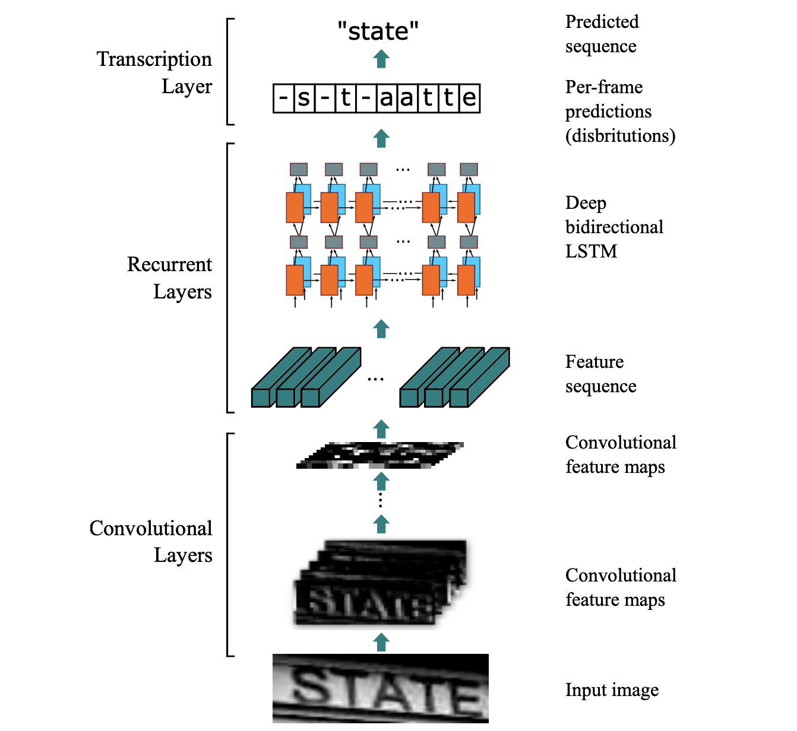

# CRNN_CaptureRecognition

## Task description
### It is recommended to learn the OCR model for captcha recognition

### Model consists of two blocks: Fully-convolutional CNN (FCNN) и Bi-LSTM, based on cross-entropy criterion.

### **Creating and training a model.** The model code is implemented through the layers of the standard torch library (torch vision.models). Also CTC-loss is implemented as well.
